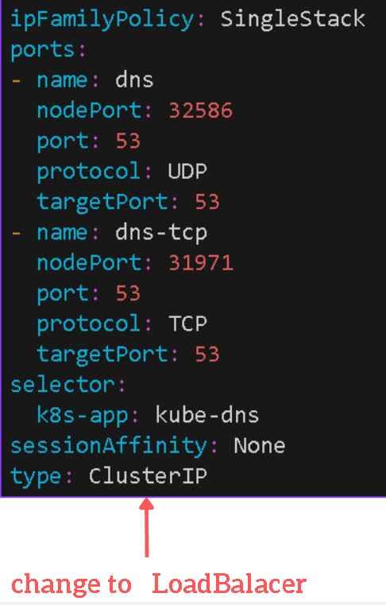

# Usage
This repository is designed to help you to create a database system between two kubernetes clusters and merge the data between two clusters in real time.   

## Diagram

### Before you begin
You need 2 kubernetes clusters avaiable on any cloud platforms

### Those two cluster shoud be on the same VPC!

### Require to be install on your machine
Kubectx Check out the installation here  <a href="https://linkerd.io/2.13/getting-started/" target="_blank" style="font-size: 20px">Link</a>

### Usage of Kubectx
You don't have to write --context=$context every time

    kubectx ${context1}
    Switched to context "${context1}".

 

### Install TiDB operator CRDS
    kubectx ${context1}
    kubectl create -f https://raw.githubusercontent.com/pingcap/tidb-operator/master/manifests/crd.yaml

 

### Install TiDB operator on Cluster 1
    kubectx ${context1}
    helm repo add pingcap https://charts.pingcap.org/
    kubectl create namespace tidb-admin 
    helm install --namespace tidb-admin tidb-operator pingcap/tidb-operator --version v1.5.0-beta.1

 

### Install TiDB operator on Cluster 2
Swaping context with kubectx is require in this step

    kubectx ${context2}
    helm repo add pingcap https://charts.pingcap.org/
    kubectl create namespace tidb-admin 
    helm install --namespace tidb-admin tidb-operator pingcap/tidb-operator --version v1.5.0-beta.1

 

### Confirm that TiDB operator is running 
    kubectl get pods --namespace tidb-admin -l app.kubernetes.io/instance=tidb-operator

output

    NAME                                       READY   STATUS    RESTARTS   AGE
    tidb-controller-manager-6d8d5c6d64-b8lv4   1/1     Running   0          2m22s
    tidb-scheduler-644d59b46f-4f6sb            2/2     Running   0          2m22s

 

### Get DNS port in our cluster machine
    kubectl get svc -n kube-system --context=${context1}
    

    
output

       
    NAME                          TYPE           CLUSTER-IP    EXTERNAL-IP     PORT                     
    kube-dns                      ClusterIP   10.0.0.10     <none>   53:32586/UDP,53:31971/TCP   
    metrics-server                ClusterIP      10.0.45.125   <none>          443/TCP                     
    npm-metrics-cluster-service   ClusterIP      10.0.62.42    <none>          9000/TCP           

External Ip of kube-dns is not avaiable case of type of kube-dns is ClusterIP if we change the type of kube-dns to be LoadBalancer the external-ip will be avaiable

    kubectl edit svc kube-dns -n kube-system --context=${context1}

    
Place to edit

    kubectl get svc -n kube-system --context=${context1}
    # Do this with the other cluster and copy both of the External IP
    # In this example for ${cluster1} ip is 20.247.240.14
    # In this example for ${cluster2} ip is 20.205.255.74

 

  
### Forward Port DNS to make cluster can communicate
Edit coredns/corednscluster1.yaml with your External Ip from cluster2
Edit coredns/corednscluster2.yaml with your External Ip from cluster1
    

    
Example coredns/corednscluster1.yaml

        
        apiVersion: v1
        kind: ConfigMap
        metadata:
        name: coredns-custom
        namespace: kube-system
        data:
        puglife.server: | 
            hello-2.svc.cluster.local:53 {
            errors
            cache 30
            forward . 20.205.255.74 {
                force_tcp
            }
        }

        # puglife.server : any name with .server is fine
        # hello-2 : your namespace that tidbcluster will be allocate in $cluster2
        # 20.205.255.74 : External Ip from cluster 2

 

### Restart Core DNS

    kubectl -n kube-system rollout restart deployment coredns --context=${context1}
    kubectl -n kube-system rollout restart deployment coredns --context=${context2}

 

### Apply TiDBCluster

    kubectl apply -f tidbcluster/tidbcluster1.yaml --context=${context1}
    kubectl apply -f tidbcluster/tidbcluster2.yaml --context=${context2}

 

### Check Status TiDB Cluster on both cluster
    kubectl get po -n hello-1 --context=${context1}
    kubectl get po -n hello-2 --context=${context2}

    
Output

    # Cluster: ${context1}
    NAME                                     READY   STATUS     
    tidbcluster1-discovery-5c49fdd79-2njvh   1/1     Running   
    tidbcluster1-pd-0                        1/1     Running   
    tidbcluster1-tidb-0                      2/2     Running   
    tidbcluster1-tikv-0                      1/1     Running   

    # Cluster: ${context2}
    NAME                                      READY   STATUS    
    tidbcluster2-discovery-56886846f8-pnzkc   1/1     Running   
    tidbcluster2-pd-0                         1/1     Running   
    tidbcluster2-tidb-0                       2/2     Running   
    tidbcluster2-tikv-0                       1/1     Running   

 

### Verify that you can connect to the database using mysql workbench or mysql client

We need to forward port to our machine and create a connection in mysql workbench or mysql client (in this case we will use mysql workbench) 

    kubectl --context=${context1} port-forward -n hello-1 svc/tidbcluster1-tidb 15000:4000

    
Output

        Forwarding from 127.0.0.1:15000 -> 4000
        Forwarding from [::1]:15000 -> 4000

 

### Open mysql workbench

 

### Create mock data to table test
    use test;

    CREATE TABLE User (
    UserID INT PRIMARY KEY,
    FirstName VARCHAR(50),
    LastName VARCHAR(50),
    Age INT,
    Email VARCHAR(100)
    );

    INSERT INTO User (UserID, FirstName, LastName, Age, Email)
    VALUES (1, 'John', 'Doe', 30, 'john.doe@example.com');

    INSERT INTO User (UserID, FirstName, LastName, Age, Email)
    VALUES (2, 'Jane', 'Smith', 25, 'jane.smith@example.com');

    SELECT * FROM test.User;

    
Output

></img>

 

### Check that cluster have been merge
Close Forward port in cluster1 and forward port for cluster2
    
    kubectl --context=${context2} port-forward -n hello-2 svc/tidbcluster2-tidb 15000:4000

 

### Query some data

    SELECT * FROM test.User;
    # If you get the same output from cluster1 that mean the your cluster have been merge

 

### Let Backup our data with minio
You can follow this docs if you prefer: <a href="https://min.io/docs/minio/kubernetes/upstream/" target="_blank" style="font-size: 20px">Link</a>

Create namespace name: minio-dev

    kubectl create ns minio-dev --context=${context1}

    kubectl apply -f minio/minio-dev.yaml --context=${context1}

    
Output

    NAME    READY   STATUS    
    minio   1/1     Running 

 

### Port Forward the minio pods and create access key ,secret key  (save the key properly because you can't rewatch it)
    kubectl port-forward pod/minio 9000 9090 -n minio-dev

 

### Create bucket and copy the name of the bucket
In my case is name: my-bucket

 

### Setup backup data s3 for cluster
You can follow this docs if you prefer: <a href="https://docs.pingcap.com/tidb-in-kubernetes/dev/backup-to-aws-s3-using-br" target="_blank" style="font-size: 20px">Link</a>

    kubectl create namespace backup-test

    kubectl apply -f backup/backup-rbac.yaml -n backup-test

    kubectl create secret generic s3-secret --from-literal=access_key=xxx --from-literal=secret_key=yyy -n backup-test --context=${context1}

    kubectl create secret generic backup-tidb-secret --from-literal=password=mypassword -n backup-test --context=${context1}

    kubectl get secret -n backup-test --context=${context1}

    
Output

    NAME                 TYPE     DATA   AGE
    backup-tidb-secret   Opaque   1      9h
    s3-secret            Opaque   2      9h

 

### Copy the External IP of TiDB cluster context1
    kubectl get svc -n hello-1 --context=${context1}

 

### Copy minio IP
    kubectl get pod -n minio-dev -o wide --context=${context1}

### Create admin on db

    kubectl --context=${context1} port-forward -n hello-1 svc/tidbcluster1-tidb 15000:4000

    # Execute this command
    # Password should be the same as secret
    # kubectl create secret generic backup-tidb-secret --from-literal=password=mypassword -n backup-test

    CREATE USER 'admin1' IDENTIFIED BY 'mypassword'; 
    GRANT ALL ON test.* TO 'admin1';
    GRANT ALL ON mysql.* TO 'admin1';
    SHOW GRANTS FOR 'admin1';

 

### Edit backup/full-backup-s3.yaml

    apiVersion: pingcap.com/v1alpha1
    kind: Backup
    metadata:
    name: demo1-full-backup-s3
    namespace: backup-test 
    spec:
    backupType: full
    br:
        cluster: tidbcluster1 <- same name in tidbcluster/tidbcluster1.yaml
        clusterNamespace: hello-1 <- namespace that tidbcluster is allocate
    from:
        host: "20.247.251.119" <- External IP of tidbcluster
        port: 4000 
        user: admin1 <- Name that you create in db 
        secretName: backup-tidb-secret 
    s3:
        provider: aws <- Can be anything you prefer
        secretName: s3-secret
        endpoint: http://10.1.1.44:9000 <- minio IP
        bucket: my-bucket <- Bucket that create in minio dashboard
        prefix: my-full-backup-folder

 

### Apply full backup to minio
    kubectl apply -f backup/full-backup-s3.yaml
    # if data is exist then you successful backup data with minio

